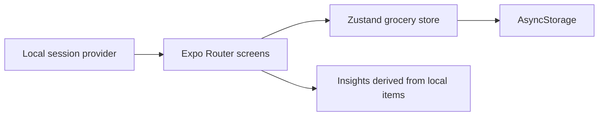

# Basketly

**Basketly** is a calm, local-first grocery planner for iOS, Android, and web. It keeps the core experience intentionally small: add items, choose a category and priority, adjust quantities, mark items as purchased, clear completed items, and review lightweight shopping insights.

The supplied project was renamed from **Grocify** to Basketly and repaired so the first run does not depend on Clerk, Sentry, a hosted database, or a pre-existing account. The list and profile are stored on the current device with AsyncStorage.

## Quick start

```bash
npm install
npm run web
```

For a type check and production-style web export:

```bash
npm run typecheck
npm run export:web
```

For native development, start the Expo development server and open the project in an iOS Simulator, Android Emulator, or Expo-compatible device:

```bash
npx expo start
```

The native `npm run ios` and `npm run android` commands are also available when the corresponding local native toolchains are installed.

## First-run experience

1. Open the app and enter an optional display name.
2. Open **Plan** and add a grocery item.
3. Return to **List** to change quantity, mark the item complete, or delete it.
4. Open **Insights** to view counts by category and priority, clear completed items, or sign out of the local profile.

No `.env` file is required for the core app.

## What was repaired

| Area | Repair |
| --- | --- |
| Product identity | Renamed the app, package, slug, scheme, visible copy, and native bundle identifiers to Basketly. |
| Startup | Removed the mandatory Clerk publishable-key check and Sentry initialization that prevented a clean first launch. |
| Authentication | Replaced the incomplete OAuth-only entry point with a local session flow that persists the display name. |
| Data | Replaced relative API calls in the primary store with typed AsyncStorage persistence that works on native and web. |
| Forms | Added validation, safe numeric quantities, loading feedback, and form preservation when a save fails. |
| Interactions | Replaced Pressable `className` styling with explicit cross-platform pressed-state styles and accessibility labels. |
| Empty state | Added a useful first-run list state with a direct link to the planner. |
| Build configuration | Removed stale Sentry Metro configuration and credential-dependent Expo plugins. |
| Developer experience | Added `typecheck` and `export:web` scripts and documented the actual setup. |

## Architecture



The primary vertical slice is local-first and has no network dependency. The existing `src/app/api` and `src/lib/server/db` files are retained as an optional future hosted-sync foundation, but the current UI does not call them.

## Project structure

```text
src/
  app/
    (auth)/sign-in.tsx       Local first-run entry screen
    (tabs)/index.tsx         Grocery list
    (tabs)/planner.tsx       Add-item planner
    (tabs)/insights.tsx      Profile and analytics
  components/                Reusable list, planner, and insights UI
  lib/session-context.tsx    Persisted local session
  store/grocery-store.ts     Typed local-first grocery state
assets/                      App icons and visual assets
app.json                     Basketly Expo configuration
```

## Optional hosted synchronization

Hosted sync is **not required** to run Basketly. If you want accounts and cross-device data later, the remaining work is explicit:

| Required work | Why it is needed |
| --- | --- |
| Choose an authentication provider and restore an auth boundary | The current session is local-only and is not an account identity. |
| Provision a PostgreSQL/Neon database and set `DATABASE_URL` | The retained server actions and API routes require a database connection. |
| Give the mobile app an absolute API base URL | Relative `/api/...` URLs are not sufficient for a device talking to a separate server. |
| Add authenticated ownership to `grocery_items` | The current retained schema is not yet a multi-user authorization model. |
| Add sync conflict handling and offline reconciliation | Cross-device edits need a defined consistency and recovery strategy. |

An example placeholder is available in `.env.example`. Do not commit real credentials.

## Verification

The repository should be checked with:

```bash
npm run typecheck
npm run export:web
```

Native simulator/device verification still depends on the developer’s installed Xcode or Android toolchain. The project is designed so that this environment-specific step is the only part that cannot be proven by a headless sandbox export.

## Notes

The app is intentionally delivered as a focused MVP rather than an unfinished full-stack product. Local persistence makes the grocery flow usable immediately; hosted accounts, cloud sync, telemetry, and production deployment should be added as separate, tested slices rather than being required for the first launch.
